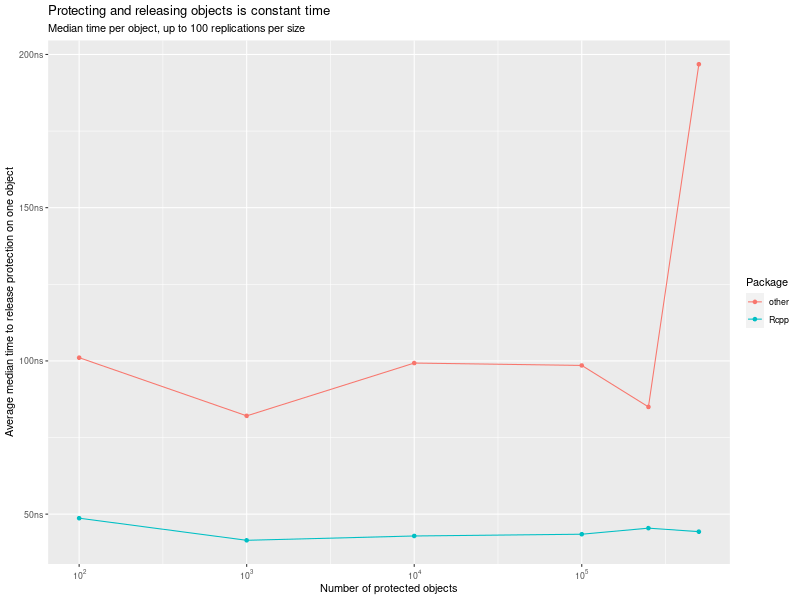
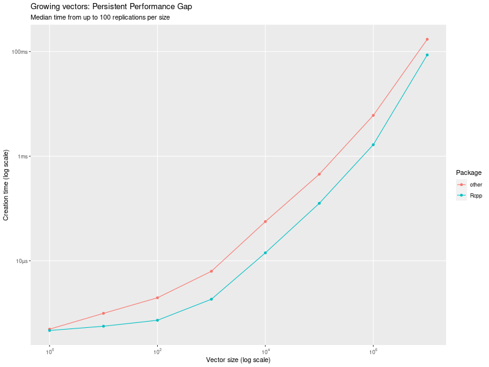

## Lies, Damned Lies and Selective Benchmarking

This repository contains a short package providing two benchmarks between [Rcpp][1] and [another package][2] on [CRAN][3] which we will refer to just as just 'other'.

The 'other' package comes with a motivating vignette containing a lot of discussion.
Its merits ("is another package needed", "is it better to restart fresh or extend an existing package", etc) may well be discussed another time.
But it also contains two benchmarks ([one](https://cran.r-project.org/package=cpp11/vignettes/motivations.html#protection) and [two](https://cran.r-project.org/package=cpp11/vignettes/motivations.html#growing-vectors)).

This note is about these two benchmarks.

One is simply outdated (and even then somewhat cheekily chosen).
The other is so obviously misleading that it alone merited this note and code repository.


### Outdated Comparison

The first of these two covers how objects are protected, and released, internally.
[Rcpp][1] initially used simple helper functions (modeled after what R does at the C level) to set (and unset) a protection bit.
This was later reworked, and a further change was filed as a _desiderata_ years ago (in [issue #382](https://github.com/RcppCore/Rcpp/issues/382)).
A helpful and detailed bug report stemming from inserting tens of thousands of _grobs_ into a plot showed that with very large number of objects, performance degraded, even crashing R.
This lead to a useful discussion (in [issue #1018](https://github.com/RcppCore/Rcpp/issues/1081)) in which for example R Core member Luke Tierney suggested an improved method (with O(1) performance) for this problem.
An initial implementation revealed side-effects and was held back from the next release.
However, it has since been completed (in PRs [#1133](https://github.com/RcppCore/Rcpp/pull/1133) and [#1135](https://github.com/RcppCore/Rcpp/pull/1135) added in January 2021), and is part of the [Rcpp][1] release 1.0.7 on [CRAN][2].

The 'other' package freshly implemented the O(1) method and then used it for a benchmark.

That is a little, well, "obviously" dented in its favor but so be it.
In any event, it is now outdated.  

So running `demo(release, package="ldlasb")` re-runs the benchmark (based on the functions in `src/release.cpp`) under the current [Rcpp][1] version and shows, lo and behold, that [Rcpp][1] is consistently faster---while both perform in the promised O(1) manner.




### "Interesting" Comparison

Since the very beginning of [Rcpp][1], it has been _clearly_ and _repeatedly_ pointed out that `push_back()` and `push_front()` were added to complete to the API with STL-alike behavior as a convenience---but one that that should not be used for real code.
This has been stated loud and clear in many places:
starting with the [original announcement in Feb 2010](https://lists.r-forge.r-project.org/pipermail/rcpp-devel/2010-February/000410.html),
several StackOverflow answers in [Dec 2011](https://stackoverflow.com/a/8631853/143305) and in [Dec 2012](https://stackoverflow.com/a/13783044/143305),
a post in the the rcpp-devel list in [Jun 2013](https://lists.r-forge.r-project.org/pipermail/rcpp-devel/2013-June/006078.html),
another StackOverflow answer in [Nov 2013](https://stackoverflow.com/a/19829440/143305),
an early Rcpp Gallery post in [Dec 2013](https://gallery.rcpp.org/articles/plyr-c-to-rcpp/),
again on StackOverflow [Dec 2014](https://stackoverflow.com/a/27585789/143305), 
as well as in the 'Advanced R' [first](http://adv-r.had.co.nz/Rcpp.html#stl) and [second](https://adv-r.hadley.nz/rcpp.html#stl) editions.

For emphasis, here is a quote from the [rcpp-devel post in 2013](https://lists.r-forge.r-project.org/pipermail/rcpp-devel/2013-June/006078.html):

> Those are somehow cosmetic additions. The usual suggestion is not to
> use push_front and push_back on Rcpp types.
>
> We use R's memory, and in R, resizing a vector means moving the data.
> So if you push_back 3 times, you're moving the data 3 times.
>
> Using R own memory is the best ever decision we made in Rcpp. You can
> always use your own data structures to accumulate data, perhaps using
> stl types and then convert back to R types, which is something we make
> easy to do.

Many code examples and packages show exactly that approach (as _e.g._ discussed
in the [Rcpp Gallery post](https://gallery.rcpp.org/articles/plyr-c-to-rcpp/)).
Anybody who claims otherwise is (possibly intentionally) misleading.

Yes what does the 'other' package show in comparison?  

Just that.
While this could be taken as an honest mistake, it has the "smell" of yet another rather explicitly chosen comparison.

Now, if and when one actually does as the more than half-dozen _very clear_ recommendations cited above suggests and _grows an STL object_ then the picture changes as seen when running `demo(grow, package="ldlasb")` (based on the functions in `src/grow.cpp`):




[Rcpp][1] wins, again.

### Repository

This repository contains all the code that is needed to run the two benchmarks, wrapped up in a small convenience package called `ldlasb`.
It cleanly passes `R CMD check` too. 
You can install it the usual ways including via, _e.g._, 

```r
remotes::install_github("eddelbuettel/ldlasb")
```

### Run Benchmarks

Once the package is installed, you can reach the benchmarks via `demo(release, package="ldlasb", ask=FALSE)` and `demo(grow, package="ldlasb", ask=FALSE)`, respectively.

The results shown here were generated on my standard machine (currently) running Ubuntu 20.10 with, _inter alia_, R 4.1.0 and g++ 10.3.0, on an i7-8700K cpu.
We can expects to vary somewhat between systems and compilers, but the overall outcome should not change.

### Author

This package was written by Dirk Eddelbuettel.

Code from the 'other' package was used to reproduce / replicate the benchmarks and graphs; see [here for more](inst/AUTHORS).

### License

This package is licensed under the GNU GPL, Version 2 or later.

[1]: https://github.com/RcppCore/Rcpp
[2]: https://CRAN.R-Project.org/package=cpp11
[3]: https://CRAN.R-Project.org
